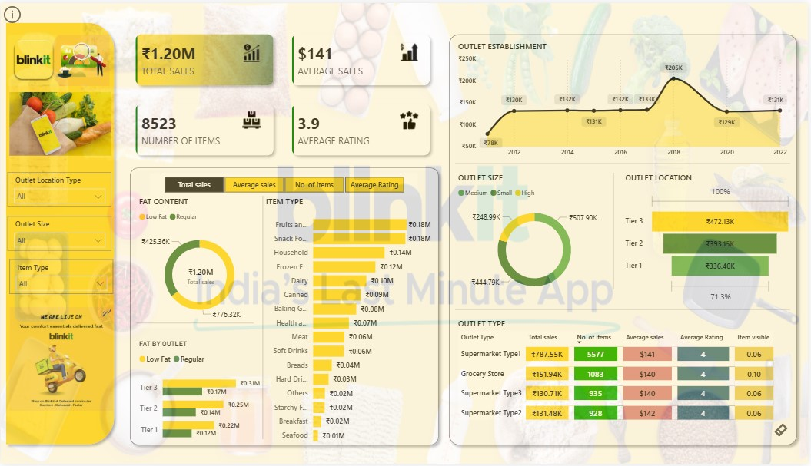

# Blinkit Sales Analysis Power BI Dashboard



## 📊 Project Overview

This project is an interactive **Blinkit Sales Analysis Dashboard** built using **Microsoft Power BI**. The dashboard provides a comprehensive view of sales performance, product categories, outlet characteristics, customer ratings, and item-level metrics.

The goal of this project is to transform raw Blinkit sales data into meaningful business insights that can support **data-driven decision-making**.

## 🎯 Objectives

* Analyze overall sales performance and key business KPIs.
* Identify top-performing product categories.
* Compare sales across different outlet types and locations.
* Analyze the impact of outlet size and establishment year on sales.
* Understand product performance based on fat content and item type.
* Track average customer ratings and item visibility.
* Build an interactive and user-friendly Power BI dashboard.

## 📌 Key KPIs

| KPI                 |  Value |
| ------------------- | -----: |
| **Total Sales**     | ₹1.20M |
| **Average Sales**   |   ₹141 |
| **Number of Items** |  8,523 |
| **Average Rating**  |    3.9 |

## 📈 Dashboard Features

### Sales Analysis

* Total sales and average sales
* Sales performance by outlet establishment year
* Sales comparison across outlet locations

### Product Analysis

* Sales by item type
* Sales based on fat content
* Number of items across categories
* Average rating by product-related segments

### Outlet Analysis

* Outlet size analysis
* Outlet location analysis
* Outlet type comparison
* Item visibility analysis

### Interactive Filters

The dashboard includes filters for:

* **Outlet Location Type**
* **Outlet Size**
* **Item Type**

These filters allow users to dynamically explore different segments of the business.

## 🔍 Key Insights

* Blinkit generated approximately **₹1.20M in total sales** across **8,523 items**.
* The overall average sales value is approximately **₹141**, with an average customer rating of **3.9**.
* **Supermarket Type1** contributes the highest sales among the outlet types shown.
* Sales vary significantly based on **outlet location tier and outlet size**.
* Product categories such as **Fruits & Vegetables** and **Snack Foods** are among the leading contributors to sales.
* Outlet establishment year analysis shows noticeable changes in sales performance across different years.

## 🛠️ Tools & Technologies

* **Microsoft Power BI**
* **Power Query**
* **DAX**
* **Data Cleaning & Transformation**
* **Data Visualization**
* **Business Intelligence**

## 📂 Project Structure

```text
Blinkit-Sales-Analysis-PowerBI/
│
├── Dashboard.jpg
├── Blinkit Sales Analysis.pbix
└── README.md
```

## 📊 Dashboard Preview

The dashboard contains:

* KPI cards
* Line/area chart for outlet establishment trends
* Donut charts for fat content and outlet size
* Bar charts for item categories and outlet locations
* Outlet type performance table
* Interactive slicers

## 🚀 How to Use

1. Clone or download this repository.
2. Install **Microsoft Power BI Desktop**.
3. Open the `.pbix` file.
4. Use the available filters and visuals to explore the data.
5. Interact with the dashboard to analyze different business segments.

## 💡 Skills Demonstrated

* Data Analysis
* Data Visualization
* Power BI Dashboard Development
* DAX
* Power Query
* KPI Development
* Business Intelligence
* Exploratory Data Analysis
* Business Insight Generation

## 👨‍💻 Author

**Tamilarasan**

B.Tech Computer Science & Engineering

GitHub: **[tamil1208](https://github.com/tamil1208)**

---

⭐ If you find this project useful, consider giving the repository a star!
